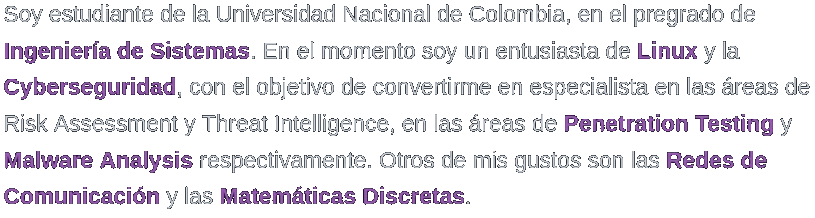
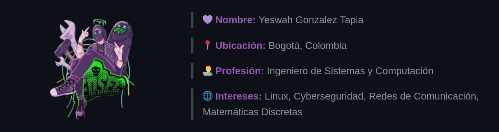

<h1>👾 Привет, я Yeswah Gonzalez 👾</h1>
<h3>Entusiasta de Linux & Ciberseguridad</h3>

<h2>Proyectos</h2>

<table>
  <thead>
    <tr>
      <th>Proyecto</th>
      <th>Lenguajes Usados</th>
      <th>Descripción breve</th>
      <th>Enlace</th>
    </tr>
  </thead>
  <tbody>
    <tr>
      <td><strong>Panadería y Pastelería: "El buen Gusto panaderia"</strong></td>
      <td><ul>
        <li>SQL</li>
      </ul></td>
      <td>Proyecto académico enfocado en el modelado y gestión de bases de datos para una panadería de barrio en Bogotá.</td>
      <td><a href="https://github.com/jmpizza/proyecto-bases-datos-2024-2">Repositorio</a></td>
    </tr>
    <tr>
      <td><strong>Mimic</strong></td>
      <td><ul>
        <li>JAVA</li>
        <li>JAVASCRIPT</li>
      </ul></td>
      <td>Proyecto de programacion orientado a objetos relacionado a el aprendizaje interactivo del lenguaje de señas a traves de la tecnologia de OpenCV y un juego inspirado en el juego de "OSU!".</td>
      <td><a href="https://github.com/INGYeswah/Signlanguage">Repositorio</a></td>
    </tr>
    <tr>
      <td><strong>DM_15</strong></td>
      <td><ul>
                <li>PYTHON</li>
                <li>JAVASCRIPT</li> 
                <li>BASH</li>
      </ul></td>
      <td>Programa para descargar musica a traves de python y añadir metadatos a traves del API de MusicBrainz.</td>
      <td><a href="https://github.com/w15hy/download_music">Repositorio</a></td>
    </tr>
    <tr>
      <td><strong>Instalacion de Arch</strong></td>
      <td><ul><li>BASH</li></ul></td>
      <td>Script para la automatizacion de la instalacion de arch linux y algunos componentes basicos, incluye i3, qemu y una pequeña configuracion de picom y otros componentes.</td>
      <td><a href="https://github.com/w15hy/arch_install">Repositorio</a></td>
    </tr>
  </tbody>
</table>

 
<!-- 
 -->

  &nbsp&nbsp&nbsp&nbsp</img>

<!--
**w15hy/w15hy** is a ✨ _special_ ✨ repository because its `README.md` (this file) appears on your GitHub profile.

Here are some ideas to get you started:

- 🔭 I’m currently working on ...
- 🌱 I’m currently learning ...
- 👯 I’m looking to collaborate on ...
- 🤔 I’m looking for help with ...
- 💬 Ask me about ...
- 📫 How to reach me: ...
- 😄 Pronouns: ...
- ⚡ Fun fact: ...
-->
